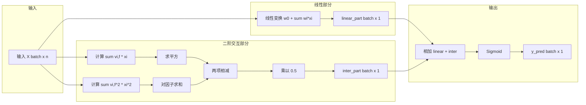
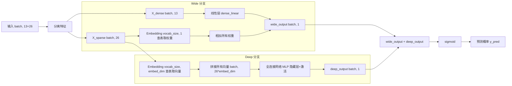

# FM-WideDeep-on-Criteo-and-MovieLens
## 项目简介：
使用FM算法与WideDeep算法分别在Criteo与MovieLens数据集上进行预测，得到基线模型.

## 项目结构

```
FM-WideDeep-on-Criteo-and-MovieLens/
├── Data/
│   ├── train.txt                # Criteo 数据集
│   └── ml-100k/                 # MovieLens 数据集
│       ├── u.data
│       ├── u.user
│       └── u.item
├── FM.py                        # FM 模型训练脚本
├── WideDeep on Criteo.py       # WideDeep 在 Criteo 上的训练
├── WideDeep on MovieLens.py    # WideDeep 在 MovieLens 上的训练
├── utils.py                     # 辅助函数
├── config.py                    # 配置文件
├── requirements.txt             # 依赖列表
├── README.md
└── .gitignore
```


## 数据集说明：
Criteo使用train.txt, MovieLens使用ml-100k数据集.


## 模型流程图：
#### FM：


#### WideDeep：

## 运行方式：
pip install -r requirements.txt + python FM.py + WideDeep on Criteo.py + WideDeep on MoiveLens.py

## 代码结构说明:

FM.py：包含 FM 模型定义、Criteo 和 MovieLens 数据的加载与训练逻辑。

WideDeep on Criteo.py：包含 Wide & Deep 模型在 Criteo 数据集上的训练与评估。

WideDeep on MoiveLens.py：包含 Wide & Deep 模型在 MovieLens 数据集上的训练与评估

## 运行结果：

| 模型 | 数据集 | 主要指标 | 结果     |
| ------ | :-------: |------------- |--------|
| FM | Criteo | 准确率 | 0.7867 |
| FM | ml-100k | AUC | 0.7526 |
| WideDeep | Criteo | 准确率 | 0.7775 |
| WideDeep | ml-100k | AUC | 0.8009 |


FM on Criteo(Acc = 0.7867):


FM on MovieLens(k = 32, AUC = 0.7526):


WideDeep on Criteo(Acc = 0.7775):


WideDeep on MovieLens(AUC = 0.8009):


## 核心结果解读
WideDeep在MovieLens上AUC达0.8010，较FM提升约0.05，说明引入深度网络能更好地捕捉特征交互。

## 局限与改进方向
当前未做超参数调优，未来可使用Optuna搜索；模型未在完整Criteo数据集上验证，后续可扩展

基于FM的CTR预测: [https://blog.csdn.net/Amarashi/article/details/163417299?spm=1011.2415.3001.5331]

基于WideDeep的CTR预测: [https://blog.csdn.net/Amarashi/article/details/163399394?spm=1011.2415.3001.5331]

基于FM的MovieLens的评分预测: [https://blog.csdn.net/Amarashi/article/details/163483814?spm=1011.2415.3001.5331]

基于WideDeep的MovieLens的评分预测:[https://blog.csdn.net/Amarashi/article/details/163542955spm=1011.2415.3001.5331]
