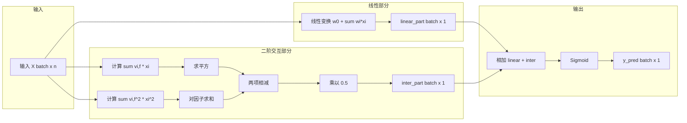
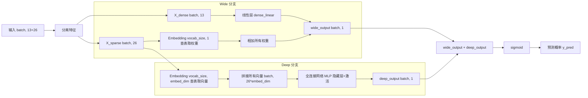

# FM-WideDeep-on-Criteo-and-MovieLens
## 项目简介：
使用FM算法与WideDeep算法分别在Criteo与MovieLens数据集上进行预测，得到基线模型.
并验证WideDeep在统计意义上显著优于FM
## 项目结构

```
FM-WideDeep-on-Criteo-and-MovieLens/
├── Data/
│   ├── train.txt                # Criteo 数据集
│   └── ml-100k/                 # MovieLens 数据集
│       ├── u.data
│       ├── u.user
│       └── u.item
├── FM.py                        # FM 模型训练脚本
├── WideDeep_on_Criteo.py       # WideDeep 在 Criteo 上的训练
├── WideDeep_on_MovieLens.py    # WideDeep 在 MovieLens 上的训练
├── utils.py                     # 辅助函数
├── config.py                    # 配置文件
├── requirements.txt             # 依赖列表
├── README.md
└── .gitignore
```


## 数据集说明：
Criteo使用train.txt, MovieLens使用ml-100k数据集.


## 模型流程图：
#### FM：


#### WideDeep：

## 运行方式：
pip install -r requirements.txt + python FM.py + WideDeep on Criteo.py + WideDeep on MoiveLens.py

## 代码结构说明:

FM.py：包含 FM 模型定义、Criteo 和 MovieLens 数据的加载与训练逻辑。

WideDeep_on_Criteo.py：包含 Wide & Deep 模型在 Criteo 数据集上的训练与评估。

WideDeep_on_MoiveLens.py：包含 Wide & Deep 模型在 MovieLens 数据集上的训练与评估

## 运行结果（随机划分）

| 模型 | 数据集 | 主要指标 | 结果 |
| :--- | :--- | :--- | :--- |
| FM | Criteo | 准确率 | 0.7867 |
| FM | ml-100k | AUC | 0.7526 |
| WideDeep | Criteo | 准确率 | 0.7775 |
| WideDeep | ml-100k | AUC | 0.8009 |

## 时间切分实验

为了模拟真实推荐系统的时序特性，我们对 MovieLens 数据按时间戳排序，以前 80% 为训练集、后 20% 为测试集。实验表明，WideDeep 的 AUC 从随机划分时的 0.8009 降至 0.72，说明随机划分存在显著的时间泄露。时序划分下的评估结果更能反映模型在真实场景中的泛化能力。

FM on Criteo(Acc = 0.7867):


FM on MovieLens(k = 32, AUC = 0.7526):


WideDeep on Criteo(Acc = 0.7775):


WideDeep on MovieLens(AUC = 0.8009):


## 核心结果解读
WideDeep在MovieLens上AUC达0.8010，较FM提升约0.05，说明引入深度网络能更好地捕捉特征交互。

为了模拟真实推荐系统的时序特性，我对数据按时间戳进行了排序，并以前 80% 作为训练集、后 20% 作为测试集。实验结果表明，时间切分后 WideDeep 模型 AUC 从 0.8 降至 0.72，说明先前随机划分存在显著的时间泄露。这一结果也表明，在离线评估中，时序划分对于获得可靠的模型性能估计至关重要。

## 实验记录：Criteo 数据集上的负采样尝试

### 背景与动机
Criteo CTR 预估任务中，正样本（点击）比例极低（通常 < 1%）。若不进行负采样，模型会因正负样本极度不平衡而倾向于预测负类，导致学习失效。为此，我们在 FM 模型上进行了负采样实验，旨在平衡训练集的正负比例，提升模型对正样本的识别能力。

### 实施方案
- **采样方法**：对训练集进行随机下采样，将正负样本比例调整为 **1:3**。
- **模型与数据**：使用 FM 模型，训练集样本量约 [1500] 条（采样前），测试集保持原始分布。

### 结果与分析
| 配置 | 测试 AUC | 测试准确率  | 说明 |
| :--- | :--- |:-------| :--- |
| **未采样（基线）** | [0.62] | [0.77] | 原始数据，正负比例约 1:99 |
| **负采样（1:3）** | [0.62] | [0.77] | 训练集采样后，正负比例 1:3 |

实验结果显示，在该 Criteo 子集上，负采样对 AUC 的改善不明显。我们分析可能的原因如下：
- 数据量限制：当前使用的 Criteo 子集仅约 1500 条样本，采样后训练集进一步缩小至约 1300 条，不足以让模型学到稳定的特征交互模式。
- 数据分布差异：采样改变了训练集的类别分布，而测试集仍为原始分布，可能导致模型泛化偏差。
- 模型容量匹配：FM 在小数据集上已有较好表现，负采样的增益可能需要在更大数据集（如完整 Criteo）上才能体现。

### 结论与后续方向
- 在小样本 Criteo 子集上，负采样未带来显著 AUC 提升，表明在数据量不足时，采样策略的效果受限。
- 后续计划在更大的 Criteo 数据集（如 10 万条以上）上重新验证负采样的效果，并对比 FM 与 WideDeep 在此策略下的表现差异。
- 本实验也提示我们，CTR 任务中的采样策略需要根据数据规模谨慎评估，不宜盲目套用。

## 模型对比与统计检验

为了评估WideDeep是否在统计意义上显著优于FM，我对两者在MovieLens上进行了5折交叉验证，并记录了每折的AUC。

### 实验设置

- **数据集**：MovieLens 100K（按时间戳排序后前80%为训练，后20%为测试）。
- **评估指标**：AUC（ROC曲线下面积）。
- **验证方法**：5折交叉验证（shuffle=True, random_state=42），确保每折的数据划分一致。
- **统计检验**：采用配对t检验，比较FM和WideDeep在相同5折上的AUC差异，显著性水平α=0.05。

### 实验结果

| 模型 | 5折AUC (均值 ± 标准差) |
| :--- | :--- |
| **FM** | 0.7412 ± 0.0039 |
| **WideDeep** | **0.7960 ± 0.0054** |

### 统计检验

配对t检验结果：
- t统计量：**12.7945**
- p值：**0.0002**

由于 p值 < 0.05，我们在统计上拒绝原假设，认为 **WideDeep模型的AUC显著高于FM模型**。

### 结论

WideDeep在MovieLens上的表现显著优于FM，且该提升在统计上并非随机波动所致。


## 局限与改进方向
当前未做超参数调优，未来可使用Optuna搜索；模型未在完整Criteo数据集上验证，后续可扩展

基于FM的CTR预测: [https://blog.csdn.net/Amarashi/article/details/163417299]

基于WideDeep的CTR预测: [https://blog.csdn.net/Amarashi/article/details/163399394]

基于FM的MovieLens的评分预测: [https://blog.csdn.net/Amarashi/article/details/163483814]

基于WideDeep的MovieLens的评分预测:[https://blog.csdn.net/Amarashi/article/details/163542955]
